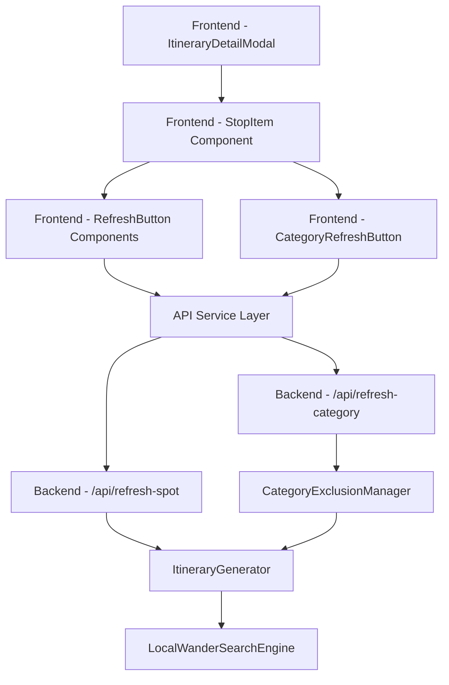

# Design Document

## Overview

The Category Refresh Feature extends the existing spot refresh functionality by adding the ability to replace spots with alternatives from different categories. This feature introduces a dual-refresh system: users can either refresh within the same category (existing functionality) or refresh to a completely different category (new functionality).

The design implements an intelligent exclusion system that tracks refreshed categories per location and prevents them from being recommended for 5 subsequent refresh operations, ensuring diverse and non-repetitive suggestions.

## Architecture

### System Components



### Data Flow

1. **User Interaction**: User clicks either spot refresh or category refresh button
2. **Frontend Processing**: Component determines refresh type and calls appropriate API
3. **Backend Processing**: Server processes request using exclusion logic
4. **Data Retrieval**: System searches for alternatives using LocalWander engine
5. **Response**: New spot data returned and UI updated

## Components and Interfaces

### Frontend Components

#### Enhanced StopItem Component
```typescript
interface StopItemProps {
  stop: Stop;
  isLast: boolean;
  location: string;
  onRefresh: (stopId: string) => void;
  onCategoryRefresh: (stopId: string) => void; // NEW
  isRefreshing: boolean;
  isCategoryRefreshing: boolean; // NEW
  excludedCategories: string[]; // NEW
}
```

#### New CategoryRefreshButton Component
```typescript
interface CategoryRefreshButtonProps {
  onClick: () => void;
  isLoading: boolean;
  disabled: boolean;
  size?: 'sm' | 'md';
}
```

### Backend Components

#### New CategoryExclusionManager Class
```python
class CategoryExclusionManager:
    def __init__(self):
        self.exclusions: Dict[str, Dict[str, int]] = {}
    
    def exclude_category(self, location: str, category: str) -> None
    def is_category_excluded(self, location: str, category: str) -> bool
    def increment_turn(self, location: str) -> None
    def get_available_categories(self, location: str, all_categories: List[str]) -> List[str]
```

#### Enhanced ItineraryGenerator Methods
```python
def generate_alternative_category_spot(
    self, 
    location: str, 
    current_category: str,
    excluded_categories: List[str],
    excluded_spot_ids: List[str]
) -> Optional[Dict]
```

### API Interfaces

#### New Category Refresh Endpoint
```python
class RefreshCategoryRequest(BaseModel):
    location: str
    current_category: str
    excluded_spot_ids: List[str] = []

@app.post("/api/refresh-category")
async def refresh_category(request: RefreshCategoryRequest) -> Stop
```

## Data Models

### Enhanced Frontend State Management
```typescript
interface ItineraryModalState {
  stops: Stop[];
  refreshingSpotId: string | null;
  categoryRefreshingSpotId: string | null; // NEW
  seenSpotIds: string[];
  excludedCategories: string[]; // NEW
  categoryExclusionTurns: number; // NEW
  error: string | null;
}
```

### Backend Exclusion Tracking
```python
# In-memory storage structure
exclusion_store = {
    "location_key": {
        "excluded_categories": ["Restaurant", "Cafe"],
        "turn_count": 3,
        "exclusion_turns": {
            "Restaurant": 2,  # turns remaining
            "Cafe": 1
        }
    }
}
```

## Error Handling

### Frontend Error States
1. **No Alternative Categories Available**: Display message suggesting to try spot refresh instead
2. **Network Errors**: Standard network error handling with retry options
3. **Invalid Category**: Handle cases where current category is not recognized
4. **Loading States**: Proper loading indicators for both refresh types

### Backend Error Responses
1. **404 - No Alternatives Found**: When no spots available in alternative categories
2. **400 - Invalid Request**: When required parameters are missing or invalid
3. **500 - Server Error**: For unexpected errors during processing

### Error Recovery Strategies
- Fallback to spot refresh if category refresh fails
- Clear exclusions if all categories become unavailable
- Graceful degradation when exclusion tracking fails

## Testing Strategy

### Unit Tests

#### Frontend Tests
- Component rendering with dual refresh buttons
- State management for category exclusions
- API service method calls
- Error handling and loading states

#### Backend Tests
- CategoryExclusionManager functionality
- Alternative category selection logic
- API endpoint request/response handling
- Edge cases (no alternatives, all excluded)

### Integration Tests
- End-to-end refresh workflows
- Category exclusion persistence across requests
- UI state synchronization with backend
- Error propagation and handling

### User Acceptance Tests
- Verify dual refresh button functionality
- Test category exclusion behavior over 5+ operations
- Validate diverse category recommendations
- Confirm proper error messaging

## Performance Considerations

### Frontend Optimizations
- Debounce rapid refresh button clicks
- Optimize re-renders during state updates
- Efficient exclusion list management

### Backend Optimizations
- In-memory exclusion store for fast lookups
- Efficient category filtering algorithms
- Minimal database queries for alternative spots

### Scalability Considerations
- Memory usage for exclusion tracking (location-based cleanup)
- API response times for category searches
- Concurrent request handling

## Security Considerations

### Input Validation
- Validate location strings to prevent injection
- Sanitize category names and IDs
- Rate limiting for refresh endpoints

### Data Privacy
- No persistent storage of user preferences
- Session-based exclusion tracking only
- No sensitive data in exclusion store

## Accessibility

### UI Accessibility
- Proper ARIA labels for both refresh buttons
- Keyboard navigation support
- Screen reader friendly button descriptions
- High contrast loading states

### User Experience
- Clear visual distinction between refresh types
- Intuitive button placement and sizing
- Consistent interaction patterns
- Helpful tooltips and error messages